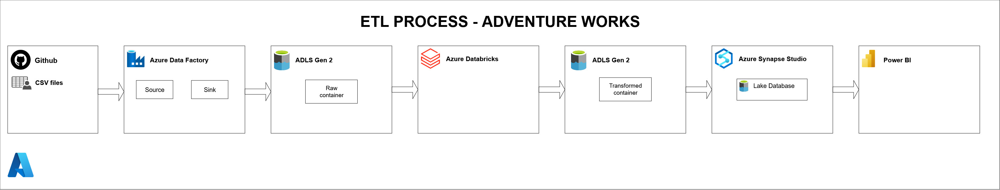
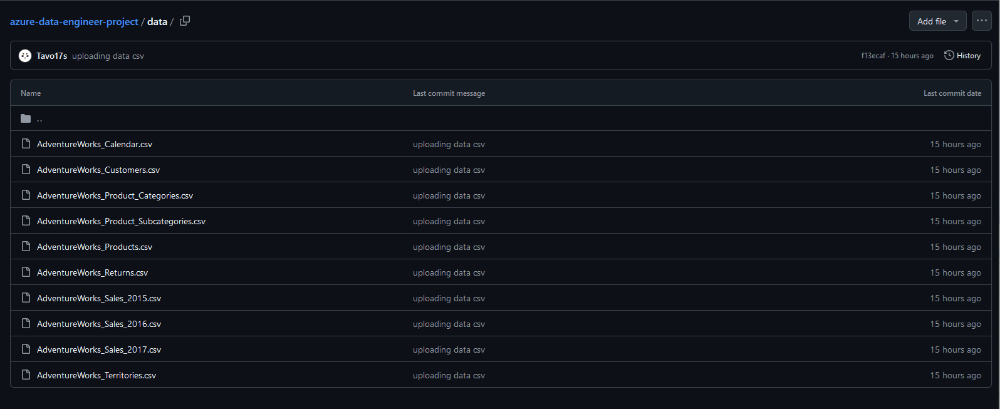
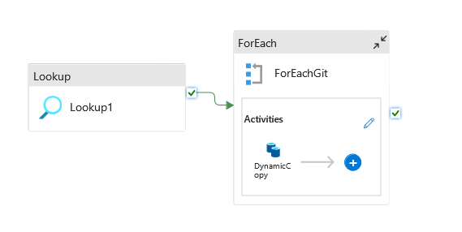
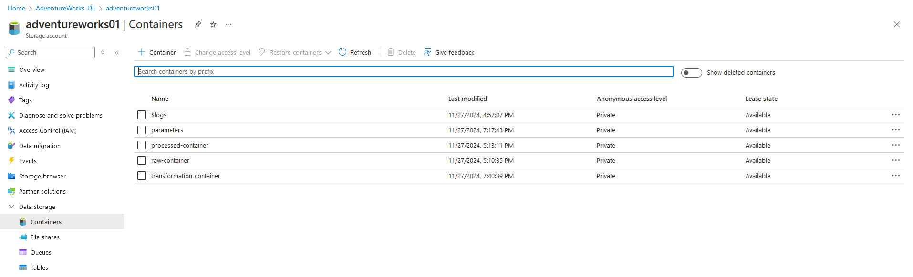
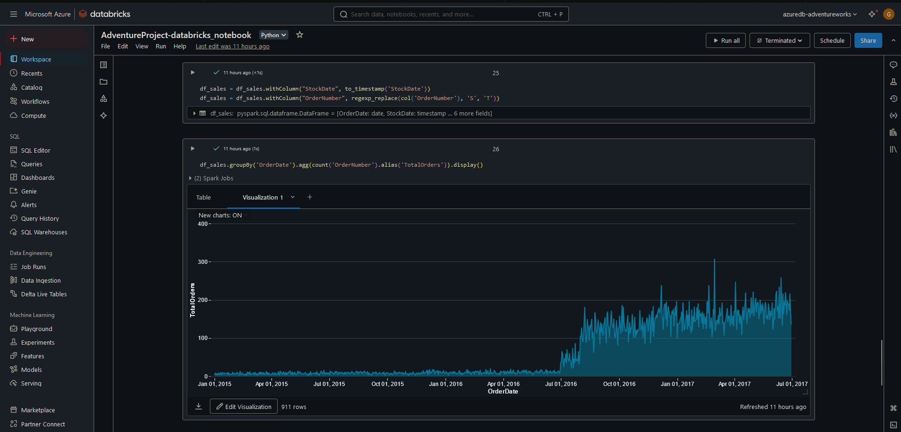
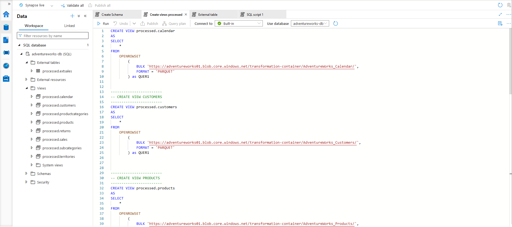
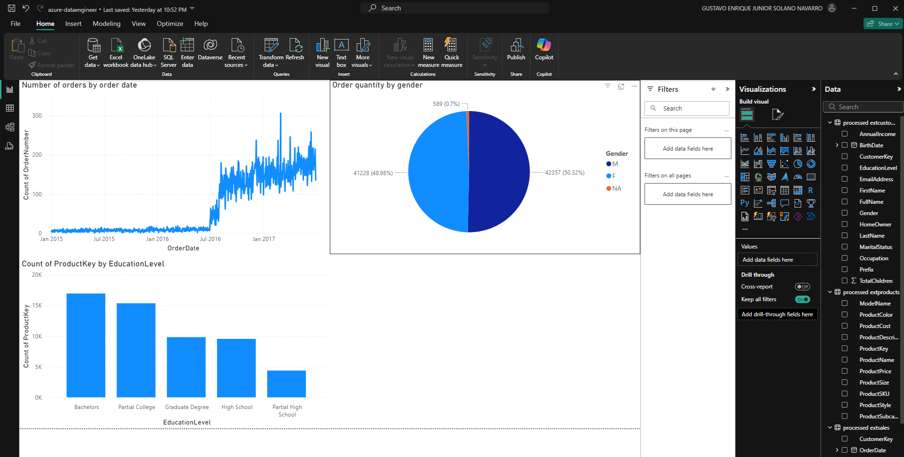

# Azure Data Engineering Project

This project demonstrates an end-to-end data engineering workflow using Azure services. The goal is to ingest, process, and analyze data efficiently, leveraging cloud-native tools for scalability and reliability.

## Overview

This project integrates various Azure services to process and analyze data sourced from a GitHub repository. The workflow follows these key steps:

- Data ingestion from GitHub.
- Storage of raw data in Azure Data Lake Storage Gen 2.
- Data transformation using Azure Databricks.
- Storage of transformed and processed data in Azure Data Lake Storage Gen 2.
- Data modeling and analysis using Azure Synapse Analytics.
- Visualization of insights with Power BI.

## Architecture

The project architecture includes the following components

### Data Source:

The dataset is hosted on GitHub and accessed via HTTP.

### Data Ingestion:

Azure Data Factory is used to extract data from GitHub and load it into a (raw) container in Azure Data Lake Gen 2.

### Data Storage:

Azure Data Lake Gen 2:

- Raw container: Stores unprocessed data as ingested from the source.
- Transformed Zone: Contains transformed and cleaned data.
- Processed Zone: Stores final views and tables in Parquet format for analytical purposes.

### Data Processing:

Azure Databricks:

- Performs ETL (Extract, Transform, Load) operations.
- Transforms raw data into a cleaned, enriched format.

### Azure Synapse Analytics:

- Creates views and tables for analysis.
- Optimizes data for visualization.

### Data Analytics:

Power BI:
- Connects to the analytics zone in Azure Data Lake Gen 2.
- Visualizes insights through interactive dashboards and charts.

## Technologies Used

### Azure Services:

- Azure Resource group
- Azure Data factory
- Azure Storage account
- Azure Data Lake Storage Gen 2
- Azure Databricks
- Azure Synapse Analytics

### Other Tools:

- GitHub (Data Source)
- Power BI